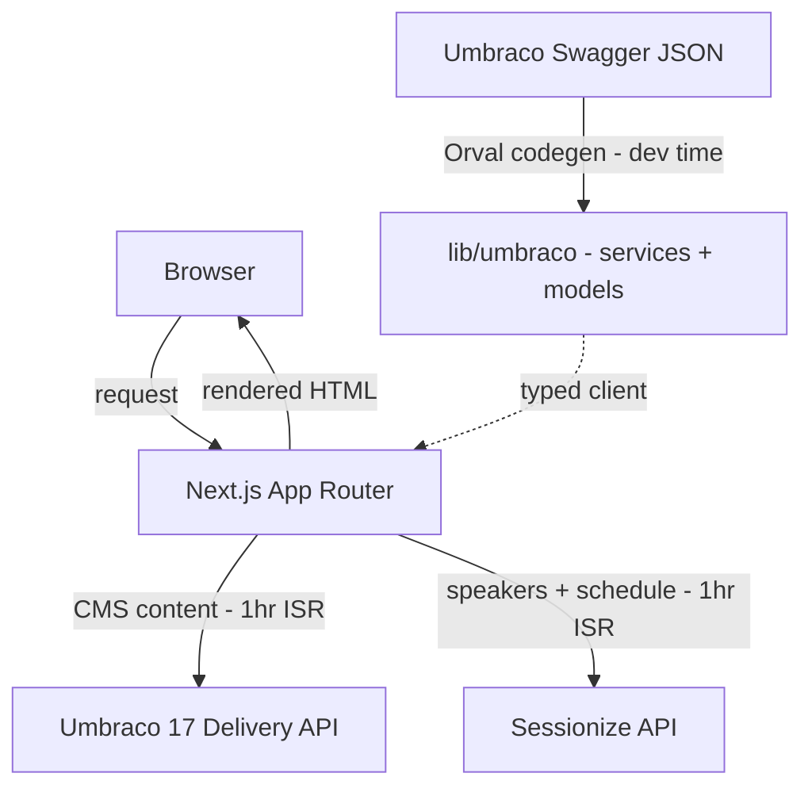

# Data Flow

Pages are Next.js server components. Two data sources:

1. **Umbraco Delivery API** — CMS content (text, media, page structure). Client code is auto-generated by Orval from the Umbraco Swagger endpoint (`https://localhost:44378/umbraco/swagger/delivery/swagger.json`) into `frontend/lib/umbraco/services/` and `frontend/lib/umbraco/models/`. The custom fetch mutator at `frontend/lib/umbraco-fetch.ts` injects auth headers and the `UMBRACO_BASE_URL` env var, and sets a 1-hour ISR revalidation by default.

2. **Sessionize API** — Speaker and schedule data fetched server-side in `frontend/lib/sessionize.ts`. Hardcoded API ID `q3a4fzac`. Also 1-hour revalidation.

